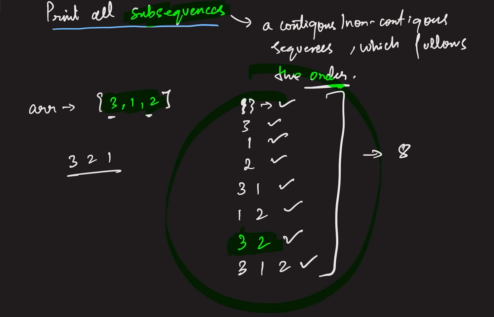

# Problems
DSA Concepts and Problem Solving from various platforms 

## Recursion 
<ul>
<li> Reverse an array with single pointer</li>
<li> Check for Palindrome</li>
<li> Multiple Recursion calls using Fibonacci series { TC - O(2^n) , can be trimmed using Dynamic Programming}</li>
<li> Recursion on Subsequences [ IMP  FOR DP ] { Hint : Assign pick or non-pick pointer to every index} </li>

<li> Very Important Patterns on Recursions for DP - Subsequence with Sum = k , Count of Subsequence with sum=k , print the first occuring subsequence with sum=k  </li>
</ul>
