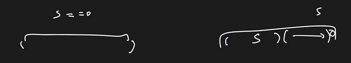
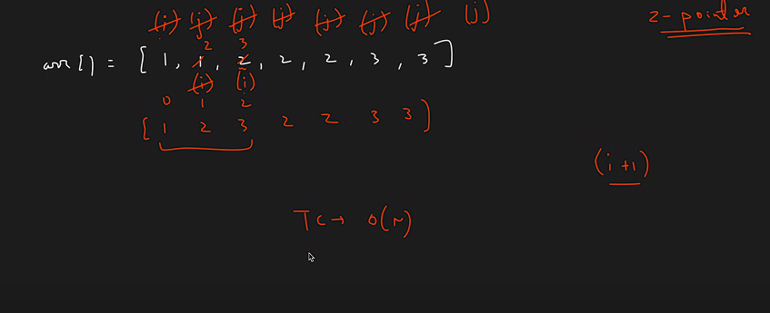

# Problems
DSA Concepts and Problem Solving from various platforms 

## Recursion 
<ul>
<li> Reverse an array with single pointer</li>
<li> Check for Palindrome</li>
<li> Multiple Recursion calls using Fibonacci series { TC - O(2^n) , can be trimmed using Dynamic Programming}</li>
<li> Recursion on Subsequences [ IMP  FOR DP ] { Hint : Assign pick or non-pick pointer to every index} </li>

<li> Very Important Patterns on Recursions for DP - Subsequence with Sum = k , Count of Subsequence with sum=k , print the first occuring subsequence with sum=k  </li>
</ul>

 

## Hashing
<ul>
<li> Two Sum using HashMap -- TC-> O(n)</li>
<li> ThreeSum using Hashset -- TC -> O(n^2) * log M</li>
<li> FourSum using Hashset { Similar to Threesum hashing , where the 3rd pointer is stored in set } --  TC -> O(n^3) * log M</li>
<li> Longest Consequetive Sequence { using unordered set } { TC -> O(3N)}</li>
<li> Largest Subarray with Zero Sum { TC --> O(NlogN)}

</ul>

## Two Pointers
<ul>
<li>Threesum using Two Pointer Approach -- TC -> O(nlogn)+O(n^2) [ Visit again - Optimal Approach ]</li>

<li> FourSum using Two Pointer Approach -- TC -> O(n^3)</li>
<li> Tapping Rainwater Problem -- TC -> O(n)<li>
<image src="image-2.png">
<li> Remove Duplicates from Sorted Array </li>

</ul>

## Arrays Algorithmic Questions 
<li>Maximum Sub Array Sum and print the Max subarray  - Kadanes Algo -- TC -> O(n)</li>
